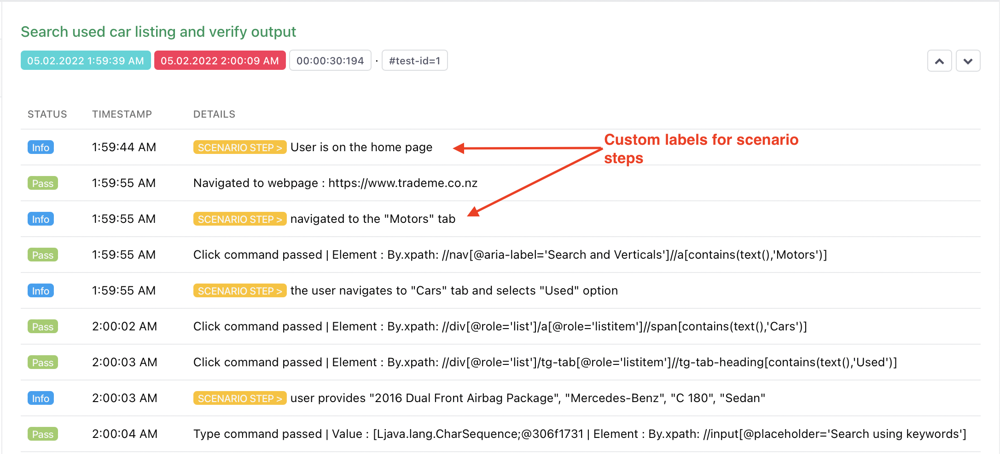
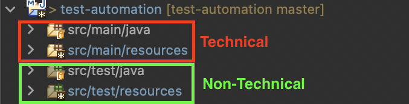

# Cucumber-Test-Framework
Cucumber Test Framework for Enhance Consulting
(Author : Chathura Dushmantha)


## Highlights

Following are the main highlights of the framework.

### Custom Extend reporting with cucumber specific formatting


### Custom PageFactory Model for parameterization & easy interaction of elements

```
// Page initialization
TradeMeSearchResultPage results = new TradeMeSearchResultPage(driver);

// custom wrapped commands as native commands
results.link_firstSearchResult.click();

// Easy parameterization of page factory elements
@FindBy(how = How.XPATH, using = "//tg-dropdown-content//span[contains(text(),'%s')]")
public Element select_searchByBodyStyleOption;

// Passing parameters easily through step definitions
motorHome.select_searchByBodyStyleOption.withParams("parameter value").click();

```

### Parallel execution capabilities
Configure paralleism by simply changing the `junit-platform.properties` file's `cucumber.execution.parallel.config.fixed.parallelism` option.

### All native Cucumber capabilities with Hooks

### Comprehensive Maven integration for different test type execution

*	`mvn test -Pweb` for web only tests
*	`mvn test -Papi` for API only tests
*	`mvn test` for all tests

### Clean project structure seperating responsibilities between technican and non technical users.



### Comprehensive logging framework with Log4J.
Ex: 
```
01:59:44.433 [ForkJoinPool-2-worker-1] INFO  com.enhance.automation.runtime.hooks.WebHooks - Started up a new ChromeDriver
01:59:44.773 [ForkJoinPool-2-worker-1] INFO  com.enhance.automation.runtime.hooks.WebHooks - Session implicitWaitTime is set to : 30 seconds
01:59:44.775 [ForkJoinPool-2-worker-1] INFO  com.enhance.automation.runtime.hooks.WebHooks - Session pageLoadTimeout is set to : 300 seconds
01:59:55.509 [ForkJoinPool-2-worker-1] INFO  com.enhance.automation.runtime.helpers.WebBrowserCommands - Navigated to webpage : https://www.trademe.co.nz
01:59:55.999 [ForkJoinPool-2-worker-1] INFO  com.enhance.automation.runtime.proxy.ElementImpl - Click command passed | Element : By.xpath: //nav[@aria-label='Search and Verticals']//a[contains(text(),'Motors')]
02:00:02.773 [ForkJoinPool-2-worker-1] INFO  com.enhance.automation.runtime.proxy.ElementImpl - Click command passed | Element : By.xpath: //div[@role='list']/a[@role='listitem']//span[contains(text(),'Cars')]
02:00:03.790 [ForkJoinPool-2-worker-1] INFO  com.enhance.automation.runtime.proxy.ElementImpl - Click command passed | Element : By.xpath: //div[@role='list']/tg-tab[@role='listitem']//tg-tab-heading[contains(text(),'Used')]
...

```


## Tools and Technologies Used
*	Java 17
*	Cucumber as the framework
*	Selenium
*	RestAssured as the API test tool
*	Maven as the build automation tool
*	Extent Reports as the custom reporting engine
* 	Log4J as the log manager

## Developer Setup

### Pre-Requirements 

*	Java JDK 17 (or newer)
*	Eclipse IDE
*	Cucumber plugin installed to the IDE 
	* https://marketplace.eclipse.org/content/cucumber-eclipse-plugin
*	Maven
	* https://maven.apache.org/install.html


### Developer Setup Steps
*	Clone the project to your local disk
	*	```git clone https://github.com/debugger89/Cucumber-Test-Framework.git```
*	Import the project as a Maven project to the IDE.
	*	In Eclipse IDE, use File > Import > Existing Maven Projects and provide the project root folder path


## Project Layout

#### The project folder contains multiple source folders:

*	src/main/java
	*	Contains the source packages for the runtime module classes. These packages will contain the abstracted out complex runtime functionalites like repporting, object proxies, hooks, logging etc. (These are not meant to be modified by non-technical users)
*	src/main/resources
	*	Contains the resource files which are required for above runtime packages. (These are not meant to be modified by non-technical users)
*	src/test/java
	*	Contains the java source packages for the cucumber test framework. Contains page objects, step definitions, cucumber runner classes.
*	src/test/resources
	*	Contains the cucumber feature files and the resource files required to be modifed by the QA users.


#### Other Folders
*	logs
	*	Contains the Log4J based log files generated during the test executions.
*	reports
	*	Contains the generated test reports through Extent reports during the execution.

## Executing the Test Scripts

### Method 1: Using Junit Plugin through IDE

The most simple way of executing the cucumber scenarios is using the Right-Click > Run method for the test runner classes. 

There are separate test runner classes for web and api scenarios.

#### Web : com.enhance.automation.runtime.runners.RunWebTests.java class in src/test/java

#### API : com.enhance.automation.runtime.runners.RunAPITests.java class in src/test/java


`Right Click on the test runner class > Run as > JUnit Test`


### Method 2: Using Maven

There are separate maven profiles for running all, web and api scenarios.

#### Runing Web Scenarios Only : `mvn test -Pweb`

#### Runing API Scenarios Only : `mvn test -Papi`

#### Runing ALL Scenarios : `mvn test`


## Configuring Execution Parameters and Parallel Executions

The local execution parameteters are provided through the `local-config.properties` file in the `src/test/resources` folder

*	_browser
	* 	Supported Browsers : CHROME, FIREFOX, SAFARI
*	_baseurlweb
	* 	Base URL of the web application to be tested	
*	_implicitwait
	*	Implicit wait timeout for each browser action (seconds)
*	_pageloadtimeout
	* 	Maximum time allowed for a page to be loaded (seconds)
*	_baseurlapi
	* 	Base URL of the API application to be tested


The JUnit related parametrs are provided through the `junit-platform.properties` file in `src/test/resources` folder

*	cucumber.execution.parallel.enabled
	*	Enable parallelism for the test runs (true/false)
*	cucumber.execution.parallel.config.fixed.parallelism
	*	Define the parallel thread count for the execution. Each scenario wioll be executed in a separate thread.


